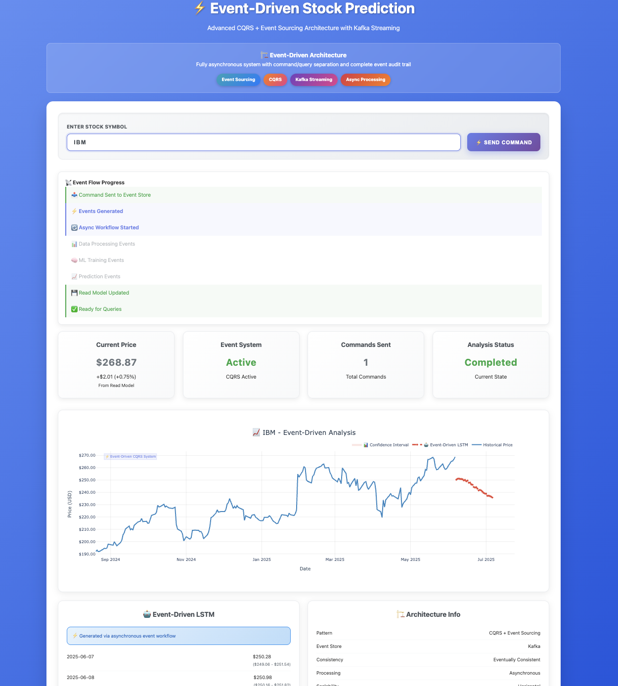

# ⚡ Event-Driven Stock Prediction

The goal of this project is to let me learn **Event-Driven Architecture**, **CQRS**, **Event Sourcing**, and **Apache Kafka** using a real-time stock prediction example with LSTM models.  

---

## 📚 Key Concepts

- **CQRS**: Separate models for commands (writes) and queries (reads)
- **Event Sourcing**: All actions recorded as immutable events
- **Kafka**: Event broker to decouple producers and consumers
- **ML Pipeline**: LSTM model with technical indicators
- **Dashboard**: Web interface to send commands and visualize results

---

## 🧱 Architecture
User → HTTP API → Command → Kafka Events → Async ML → Predictions → Read Model → 


---

## 🚀 Quick Start

### 1. Clone the Repo

```bash
git clone https://github.com/your-username/event-driven-stock-prediction.git
cd event-driven-stock-prediction
```

### 2. Install Dependencies
```bash
pip install -r requirements.txt
```

### 3. Add Environment Variables
Create a .env file:
```
FINNHUB_API_KEY=your_key
KAFKA_BOOTSTRAP_SERVERS=localhost:9092
FLASK_ENV=development
```

### 4. Start the App
```bash
python app.py

```


